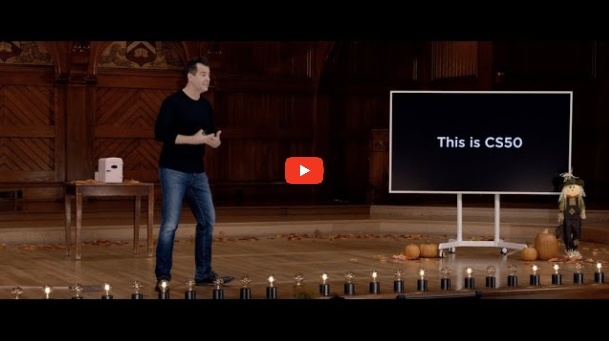

# Databases

1. Bestudeer het videocollege,
2. hou goed bij wat je opvalt en wat je leert,
3. en beantwoord dan de vragen hieronder.

Het deel over SQL in Python is voor deze cursus niet relevant.

## Links

- [Open in CS50 video player](https://video.cs50.io/zrCLRC3Ci1c?start=655)
- [Open lecture notes](https://cs50.harvard.edu/college/2022/fall/notes/7/)
- Alternatieve slides: <https://www.stat.berkeley.edu/~spector/sql.pdf>
